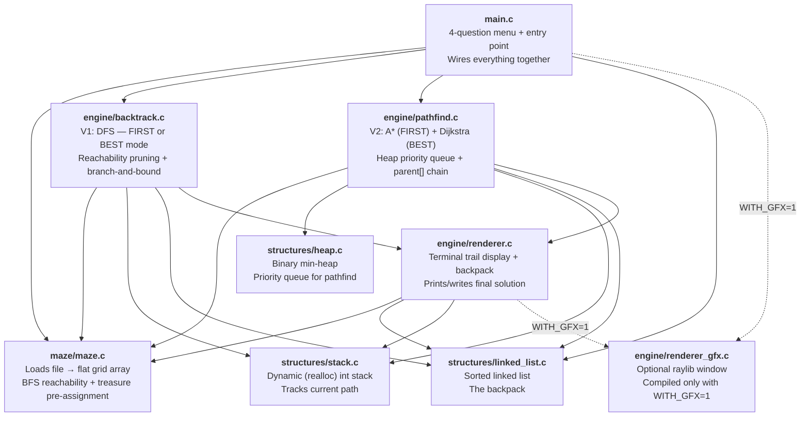
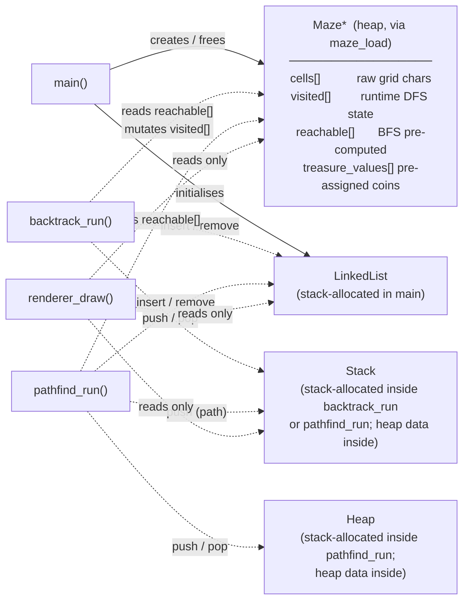
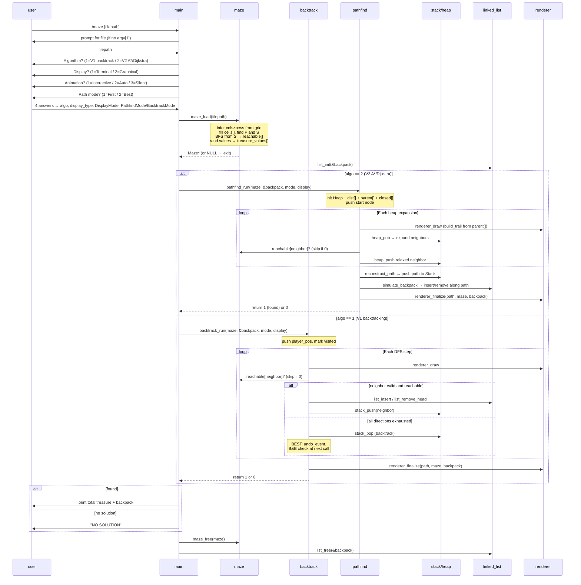
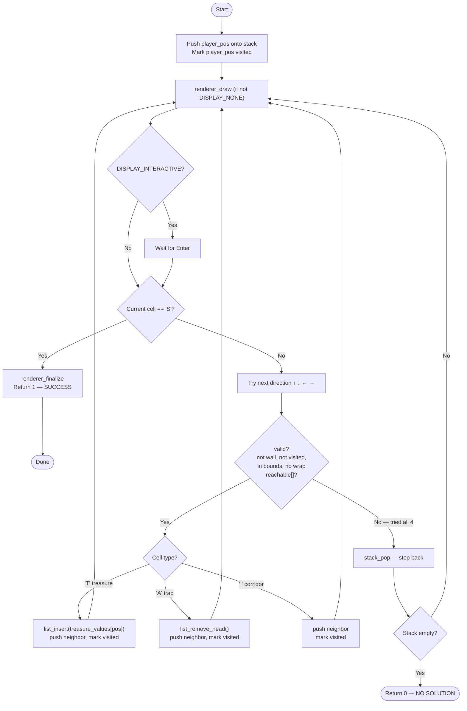
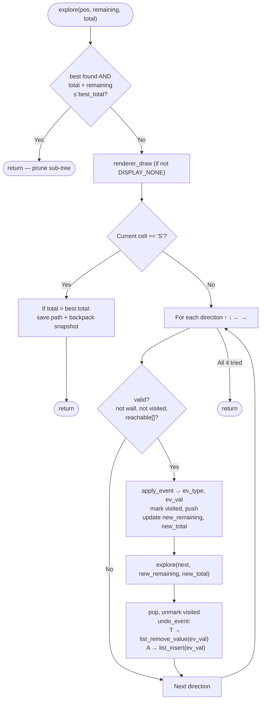

# Architecture & Flow

Visual overview of how the modules interact and what each one is responsible for.

> For search optimizations applied to `BACKTRACK_BEST` (reachability + branch and bound), see [`optimizations.md`](optimizations.md).

## 1. Module Dependency Map

Who knows about whom at compile time. Arrows mean "depends on / includes".



**Key rule:** data structures (`stack`, `linked_list`, `heap`) and `maze` have zero internal dependencies — they are the foundation. `backtrack` and `pathfind` are the two search engines; each orchestrates the structures it needs. `main` only sets up, dispatches, and tears down.

## 2. Ownership of Data

Each live object is owned by exactly one place.



## 3. Runtime Sequence

Full flow from launch to program exit. The menu now asks 4 independent questions.



## 4. V1 — Backtracking Modes

### BACKTRACK_FIRST — Iterative DFS

Stops at the first exit reached. Non-reachable neighbors are skipped via the `reachable[]` pre-computation.



### BACKTRACK_BEST — Recursive DFS with Undo + Branch and Bound

Explores all paths. Pruned by reachability and by the upper-bound check `current_total + remaining_treasure <= best_total`. On backtrack, reverses cell events using a `CellEvent` array; `current_total` and `remaining_treasure` are passed by value so undo is implicit.



## 5. V2 — Pathfinding Modes

Both A\* and Dijkstra share the same code skeleton in `pathfind.c`. The difference is the priority function stored in each `HeapNode`.

### PATHFIND_FIRST — A\*

Priority `f = g + h` where `g` = steps from start, `h` = Manhattan distance to exit.

```mermaid
flowchart TD
    START([Start]) --> INIT["dist[start]=0\nheap_push({start, h(start), 0, -1})"]
    INIT --> LOOP{heap_is_empty?}
    LOOP -->|Yes| NOSOL(["return 0 — no solution"])
    LOOP -->|No| POP["cur = heap_pop()"]
    POP --> SKIP{closed[cur.pos]?}
    SKIP -->|Yes| LOOP
    SKIP -->|No| CLOSE["closed[cur.pos] = 1\nparent[cur.pos] = cur.parent"]
    CLOSE --> DRAW["renderer_draw (build_trail)"]
    DRAW --> GOAL{cur.pos == exit?}
    GOAL -->|Yes| RECON["reconstruct_path\nsimulate_backpack\nrenderer_finalize\nreturn 1"]
    GOAL -->|No| EXPAND["For each valid reachable neighbor"]
    EXPAND --> RELAX{"new_g = cur.g+1\nnew_g < dist[next]?"}
    RELAX -->|Yes| PUSH["dist[next] = new_g\nheap_push({next, new_g+h(next), new_g, cur.pos})"]
    PUSH --> EXPAND
    RELAX -->|No| EXPAND
```

### PATHFIND_BEST — Dijkstra (max-treasure heuristic)

Priority is the negated accumulated treasure value (`-dist`), turning the min-heap into an effective max-heap.

- Only `CELL_TREASURE` cells contribute weight `w = treasure_values[next]`; corridors and traps have `w = 0`.
- Trap losses are applied during `simulate_backpack` on the final chosen path — not during expansion.
- **Trade-off:** cells are settled greedily; a later path with more net treasure after traps may be missed. This is an intentional O((V+E) log V) heuristic rather than the exact exponential solution.

## 6. Data Structure Roles

### Stack — the path memory

```
push(3)  push(4)  push(9)  pop()   peek()
  [3]   [3,4]  [3,4,9] [3,4]    → 4

Stores 1D cell indices. Top = current position.
Pop = backtrack one step.
```

`renderer_draw` uses the full stack contents to mark trail cells (`.`) on the display.

Used by: backtrack (path tracking), pathfind (reconstructed final path).

### LinkedList — the backpack

```
insert(40)   insert(15)   insert(75)   remove_head()   insert(60)
  [40]       [15,40]    [15,40,75]       [40,75]       [40,60,75]
              ^sorted                    ^15 lost
                                         (trap hit)
```

Always sorted ascending so the **head is always the cheapest treasure** — the one sacrificed on a trap, minimising total loss.

| Operation | Complexity | Caller |
|---|---|---|
| `list_insert` | O(n) — walk to sorted position | Treasure pickup |
| `list_remove_head` | O(1) — always used by traps | Trap event |
| `list_remove_value` | O(n) — undo a specific pickup | BACKTRACK_BEST undo |

### Heap — the priority queue

Binary min-heap stored as a flat array. Capacity doubles via `realloc` starting at 64 nodes.

```
Heap property: data[parent].priority <= data[child].priority

push: insert at end, sift-up   → O(log n)
pop:  swap root with last, sift-down → O(log n)
```

For Dijkstra's max-treasure variant, priorities are negated at insertion — no code change to the heap itself.

Used by: pathfind only (backtrack uses an explicit stack instead).

## 7. Maze Memory Layout

The maze is stored as a **flat 1D array** (row-major order). The `Maze` struct holds four **heap-allocated parallel arrays** over the same index space, each `malloc`'d to `rows * cols` at load time and freed by `maze_free`:

```
cells[i]           — char *; raw cell char from the file ('P', 'T', 'A', 'S', ' ', '#')
visited[i]         — char *; 0/1, mutated during DFS, reset on backtrack (BEST mode)
reachable[i]       — char *; 0/1, computed once at load by BFS from exit, never mutated
treasure_values[i] — int  *; pre-assigned coin value (1–100) for CELL_TREASURE cells, 0 otherwise
```

Index formula for a 4×5 grid (cols = 5):

```
Row 0: cells[0]  cells[1]  cells[2]  cells[3]  cells[4]
Row 1: cells[5]  cells[6]  cells[7]  cells[8]  cells[9]
...

index(row, col) = row * cols + col

Direction offsets:
  UP    = −cols   DOWN  = +cols   LEFT  = −1   RIGHT = +1
```

**Column-wrap guard:** before moving LEFT, check `current % cols == 0`; before RIGHT, check `current % cols == cols − 1`. Without this, the algorithm silently steps from the end of one row to the start of the next.
