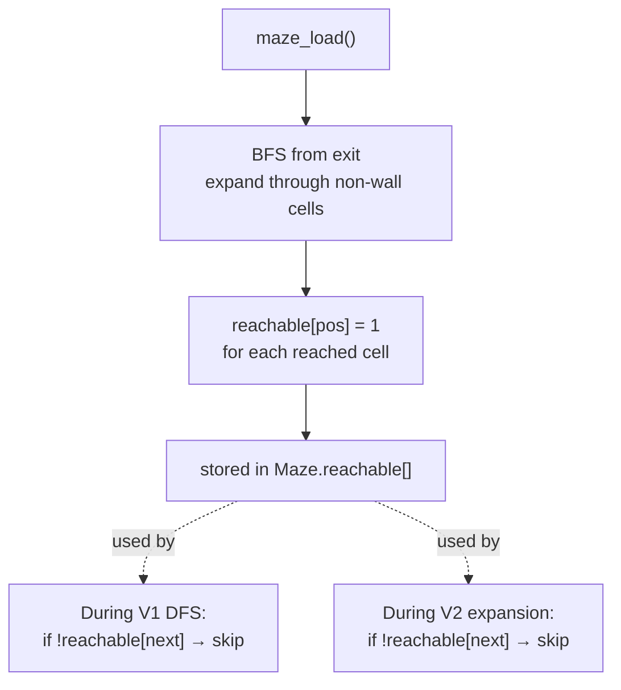
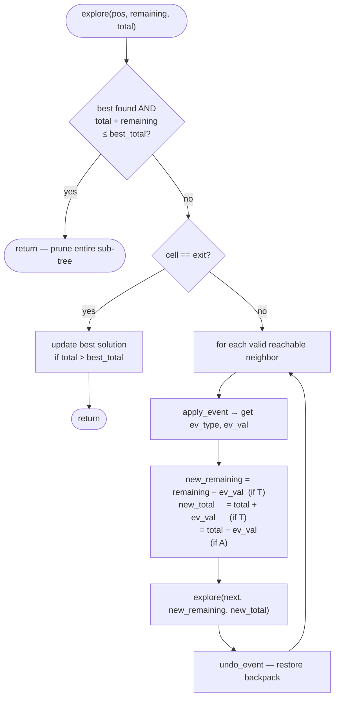
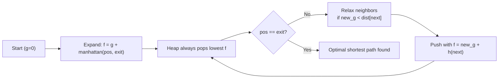
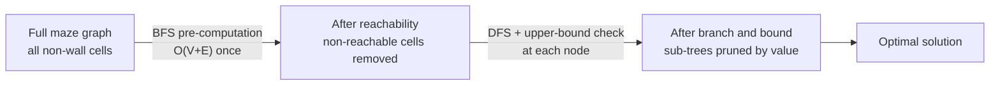

# Search Optimizations

Three complementary techniques reduce the search space and guide the algorithms toward good solutions efficiently. The first two apply to `BACKTRACK_BEST` (V1); the third applies to `pathfind` (V2). All share the same reachability pre-computation.

See also: [`architecture.md`](architecture.md) for module relationships.

## 1. Reachability Pre-computation

### Motivation

In a maze with dead-end corridors, the DFS will walk into a dead end, fail to find the exit, and backtrack — wasting time on every path that enters it. This happens even when the dead end has no treasure to justify the detour.

A single BFS pass at load time identifies which cells can ever reach the exit. Any neighbor that fails this check is skipped unconditionally during DFS or graph expansion, before visiting it.

This optimization is shared by **both** V1 (backtrack) and V2 (pathfind): `pathfind.c` applies the same `!reachable[next]` guard as `backtrack.c`.

### Algorithm

BFS runs **backward from the exit** through all non-wall cells. A cell is marked reachable if and only if there exists a path of passable cells from it to the exit — ignoring runtime visited state, which changes per DFS branch [1].

```
reachable[exit_pos] = 1
enqueue exit_pos

while queue not empty:
    pos = dequeue()
    for each neighbor of pos (UP, DOWN, LEFT, RIGHT):
        if neighbor is passable and not yet marked:
            reachable[neighbor] = 1
            enqueue neighbor
```

Column-wrap guard applies: LEFT from column 0 and RIGHT from the last column are skipped, matching the backtracker's movement rules.

### Where it runs

`maze_compute_reachability(Maze *m)` — called once at the end of `maze_load`. Result is stored in `m->reachable[]` (heap-allocated to `rows * cols` at load time). The BFS queue is also heap-allocated to `rows * cols`.

During DFS or heap expansion, one extra guard is added to every direction loop:

```c
if (!(*maze).reachable[next]) continue;
```

### Complexity

| Phase | Cost |
|---|---|
| Pre-computation | O(V + E) — single BFS over the grid [1] |
| Per search step | O(1) — array lookup |

Where V = number of passable cells, E = edges between them (at most 4V for a grid).

### Diagram



## 2. Branch and Bound (V1 BACKTRACK_BEST only)

### Motivation

Even with reachability pruning, `BACKTRACK_BEST` still explores exponentially many simple paths. The key insight: if we already found a solution worth 200 coins, we do not need to fully explore a branch where — even in the most optimistic scenario — we could collect at most 150 more coins [2][3].

### Upper Bound

Treasure values are assigned randomly at maze load time (`maze_assign_treasures`) rather than on first visit. This makes all values known upfront, allowing an exact upper bound:

```
upper_bound(current_branch) = current_total + remaining_treasure
```

Where:
- `current_total` — coins currently in the backpack along this path
- `remaining_treasure` — sum of all pre-assigned values for treasures not yet collected on this path

This is a valid (admissible) upper bound: it assumes we collect every remaining treasure with no trap losses — the most optimistic possible outcome [4].

### Pruning Rule

At the start of every recursive call:

```c
if (best->found && current_total + remaining_treasure <= best->total_value)
    return; /* can't beat the best — prune entire sub-tree */
```

Both values are maintained as plain integers passed by value through the recursion — no backpack re-summation needed at each node.

### Update Rules

| Event at `next` | `current_total` | `remaining_treasure` |
|---|---|---|
| Treasure (value V) | `+= V` | `-= V` |
| Trap (removes L from backpack) | `-= L` | unchanged |
| Corridor | unchanged | unchanged |
| Undo treasure | automatic (passed by value to child, parent unchanged) | automatic |

Because both values are passed by value into the recursive call, undoing them on backtrack requires no explicit action — the parent's copies are unaffected by the child's execution [2].

### Correctness

The bound is never an underestimate: ignoring trap losses and assuming all remaining treasures are reachable and collectible can only overstate the true maximum. Therefore, pruning when `upper_bound <= best` never discards an actually-better solution [3][4].

### Diagram



## 3. A\* Manhattan Heuristic (V2 PATHFIND_FIRST only)

### Motivation

Dijkstra (uniform-cost search) expands nodes in order of `g(n)` — total cost from start. In a grid maze where every step costs 1, this is breadth-first search, which explores rings of equal distance around the start. A\* adds a heuristic `h(n)` that estimates the remaining distance to the goal, directing expansion toward the exit rather than uniformly in all directions.

### The Manhattan Distance Heuristic

For a flat 1D-indexed grid with `cols` columns:

```c
static int manhattan(int a, int b, int cols) {
    int dr = a / cols - b / cols;   /* row difference */
    int dc = a % cols - b % cols;   /* col difference */
    if (dr < 0) dr = -dr;
    if (dc < 0) dc = -dc;
    return dr + dc;
}
```

This counts the minimum steps needed ignoring walls — the "taxicab" distance.

### Admissibility

A heuristic is **admissible** if it never overestimates the true cost to the goal [4]. Manhattan distance is admissible on a 4-connected grid because:
- Every step moves at most 1 unit in row or column.
- Walls only increase the true path length; the heuristic ignores them.
- Therefore `h(n) ≤ true_cost(n, goal)` always holds.

An admissible heuristic guarantees that A\* finds an **optimal** (shortest) path [4].

### Priority Function

Each `HeapNode` stores:
- `g` — steps from start
- `priority = g + h` — used for heap ordering

```c
HeapNode nn = {
    next,
    new_g + manhattan(next, goal, cols),  /* priority = f */
    new_g,                                /* g */
    cur.pos                               /* parent */
};
heap_push(&h, nn);
```

### Lazy Deletion (Duplicate Handling)

Rather than using a decrease-key operation (which would require a Fibonacci heap), duplicate entries for the same cell may exist in the heap. The closed set handles this:

```c
if (closed[cur.pos]) continue;   /* already settled — discard stale entry */
closed[cur.pos] = 1;
```

This is correct because a cell is first popped at its optimal `f` value — any later pop for the same cell has equal or worse `f`.

### Complexity

| Phase | Cost |
|---|---|
| A\* (worst case) | O((V + E) log V) — each cell pushed at most once per relaxation |
| Heuristic evaluation | O(1) — two arithmetic operations |

In practice, the Manhattan heuristic dramatically reduces the number of cells expanded compared to uniform-cost search (Dijkstra with `h=0`), especially when the exit is far from the start.

### Diagram



## 4. Combined Effect

### V1 — Reachability + Branch and Bound

The two V1 techniques attack different parts of the search:

| Technique | What it eliminates |
|---|---|
| Reachability | Cells that structurally cannot reach the exit — dead ends, isolated corridors |
| Branch and bound | DFS sub-trees whose best-case value can't improve the known solution |

Reachability runs first (at load time) and makes the DFS graph smaller. Branch and bound then runs at each node of that already-reduced graph, cutting branches based on value.



### V2 — Reachability + A\* Heuristic

For V2, reachability prunes the graph before expansion; the Manhattan heuristic then guides which cells are expanded first.

| Technique | Phase | Effect |
|---|---|---|
| Reachability | Load time, O(V+E) | Removes dead ends before any search begins |
| Manhattan heuristic | Per expansion, O(1) | Biases heap toward cells closer to exit |
| Closed set | Per expansion, O(1) | Prevents re-expanding settled cells |

## 5. Performance Estimates

> These are analytical estimates, not measured benchmarks. Actual times vary with maze topology and CPU.

| Maze | Grid | Passable (N) | V1 FIRST | V1 BEST (est.) | V2 A\* | V2 Dijkstra |
|---|---|---|---|---|---|---|
| `maze_10x10.txt` | 10×10 | 42 | < 1 ms | < 1 ms | < 1 ms | < 1 ms |
| `maze_20x15.txt` | 20×15 | 156 | < 1 ms | < 100 ms | < 1 ms | < 1 ms |
| `maze_30x10.txt` | 30×10 | 138 | < 1 ms | < 50 ms | < 1 ms | < 1 ms |
| `maze_40x40.txt` | 40×40 | 916 | < 1 ms | minutes–hours | < 1 ms | < 1 ms |
| 1001×1001 | 1001×1001 | ~500 K | < 1 s (first) | not feasible | < 5 s | < 5 s |

> V2 solves any maze in O((V+E) log V) regardless of size. V1 BEST complexity is governed by branch-point count, not grid dimensions. The stress-test script verifies first-path mode on corridors up to 10 000 columns/rows and generated mazes up to 1001×1001.

### Complexity Summary

| Phase | Cost |
|---|---|
| `maze_compute_reachability` | O(V + E) once at load |
| `maze_assign_treasures` | O(V) once at load |
| V1 DFS without optimization | O(μ^N) ≈ O(2.638^N) |
| V1 DFS with reachability only | O(μ^N') where N' < N |
| V1 DFS with reachability + B&B | O(μ^N' × (1 − pruning_factor)) |
| V2 A\* | O((V + E) log V) |
| V2 Dijkstra | O((V + E) log V) |

## References

[1] Cormen, T.H., Leiserson, C.E., Rivest, R.L., Stein, C. (2009). *Introduction to Algorithms*, 3rd ed. MIT Press. Ch. 22 — Breadth-First Search, pp. 594–602.

[2] Land, A.H., Doig, A.G. (1960). "An Automatic Method of Solving Discrete Programming Problems." *Econometrica*, 28(3), 497–520.

[3] Lawler, E.L., Wood, D.E. (1966). "Branch-and-Bound Methods: A Survey." *Operations Research*, 14(4), 699–719.

[4] Russell, S., Norvig, P. (2020). *Artificial Intelligence: A Modern Approach*, 4th ed. Pearson. Ch. 3 — Admissible heuristics and optimistic bounds in tree search, pp. 93–99.

[5] Duminil-Copin, H., Smirnov, S. (2012). "The connective constant of the honeycomb lattice equals √(2+√2)." *Annals of Mathematics*, 175(3), 1653–1665.
