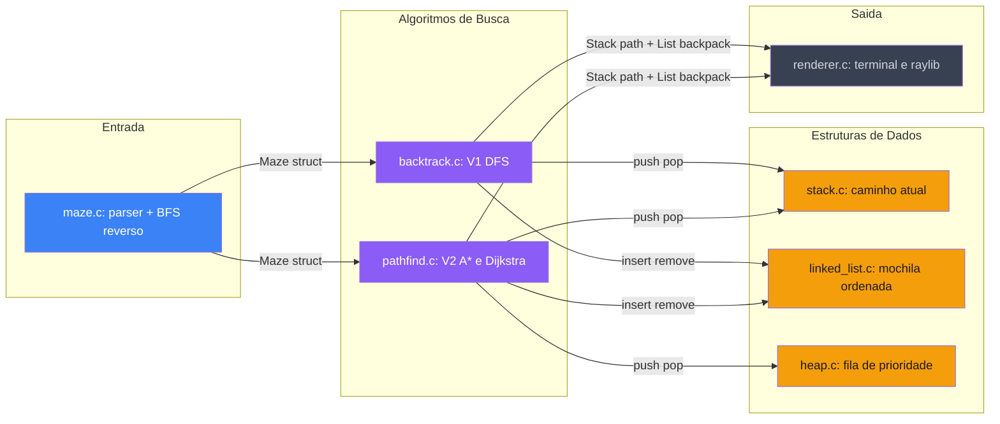
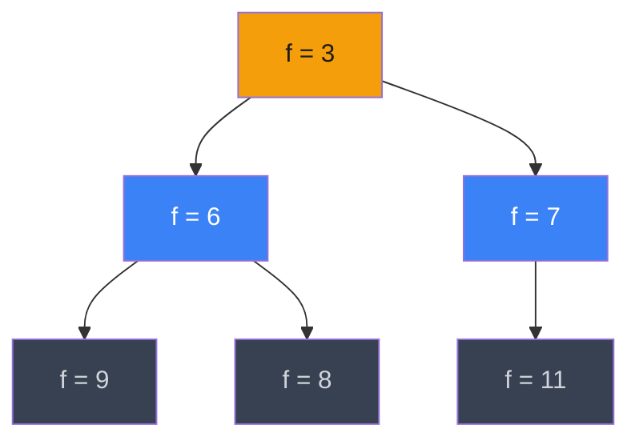
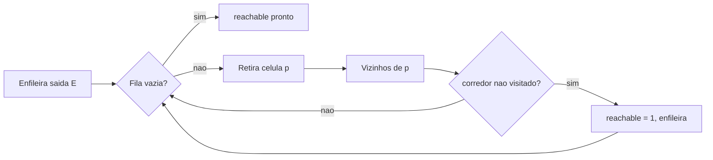
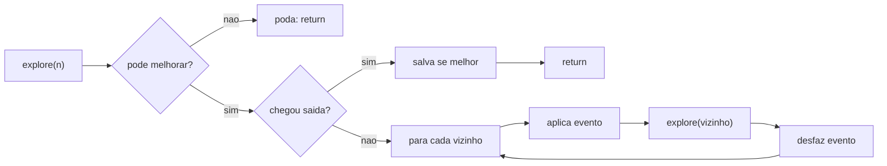
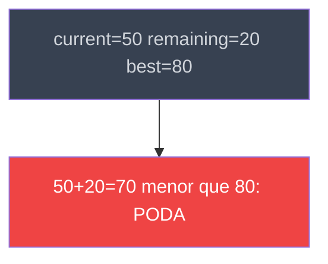
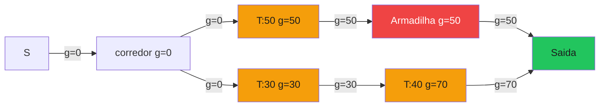

# Labirinto de Dados
## Busca com Estruturas de Dados Clássicas

**Estruturas de Dados e Algoritmos**

<div v-motion :initial="{opacity: 0, y: 20}" :enter="{opacity: 1, y: 0, transition: {delay: 300, duration: 600}}" class="mt-2 opacity-60 text-sm">
Duas gerações de solucionador · Três estruturas de dados · Um problema de caminhos
</div>

---
layout: two-cols
---

# O Problema

Um arqueólogo percorre um labirinto coletando tesouros. Armadilhas podem roubar o que foi acumulado.

**Objetivo:** chegar à saída — pelo caminho mais rápido ou pelo mais lucrativo.

**Regras da mochila**

<v-clicks>

- Tesouros são inseridos em ordem crescente
- Armadilha remove sempre o **menor** valor — minimiza a perda
- O inventário é uma lista encadeada sempre ordenada

</v-clicks>

::right::

<div class="ml-6 mt-2">

**Tipos de célula**

<div class="flex flex-col gap-2 mt-2">
  <div class="flex items-center gap-3">
    <span style="display:inline-flex;align-items:center;justify-content:center;width:2rem;height:2rem;background:#374151;border-radius:4px;font-family:monospace;font-size:0.75rem;color:#6b7280;font-weight:bold">#</span>
    <span class="text-sm"><strong>Parede</strong> — bloqueia movimento</span>
  </div>
  <div class="flex items-center gap-3">
    <span style="display:inline-flex;align-items:center;justify-content:center;width:2rem;height:2rem;background:#d1d5db;border-radius:4px;"></span>
    <span class="text-sm"><strong>Corredor</strong> — livre para caminhar</span>
  </div>
  <div class="flex items-center gap-3">
    <span style="display:inline-flex;align-items:center;justify-content:center;width:2rem;height:2rem;background:#f59e0b;border-radius:4px;font-family:monospace;font-size:0.75rem;font-weight:bold;color:#1c1c1c">T</span>
    <span class="text-sm"><strong>Tesouro</strong> — adiciona moedas à mochila</span>
  </div>
  <div class="flex items-center gap-3">
    <span style="display:inline-flex;align-items:center;justify-content:center;width:2rem;height:2rem;background:#ef4444;border-radius:4px;font-family:monospace;font-size:0.75rem;font-weight:bold;color:white">A</span>
    <span class="text-sm"><strong>Armadilha</strong> — remove o menor valor</span>
  </div>
  <div class="flex items-center gap-3">
    <span style="display:inline-flex;align-items:center;justify-content:center;width:2rem;height:2rem;background:#3b82f6;border-radius:4px;font-family:monospace;font-size:0.75rem;font-weight:bold;color:white">S</span>
    <span class="text-sm"><strong>Início</strong> — posição inicial</span>
  </div>
  <div class="flex items-center gap-3">
    <span style="display:inline-flex;align-items:center;justify-content:center;width:2rem;height:2rem;background:#22c55e;border-radius:4px;font-family:monospace;font-size:0.75rem;font-weight:bold;color:#1c1c1c">E</span>
    <span class="text-sm"><strong>Saída</strong> — célula objetivo</span>
  </div>
</div>

</div>

---

# Exemplo Visual do Labirinto

<div class="flex gap-16 items-start justify-center mt-2">

<div>
<div class="text-xs text-gray-400 mb-2 font-mono">9 × 7 células</div>

<div style="display:grid;grid-template-columns:repeat(9,2rem);gap:2px;">
  <span style="width:2rem;height:2rem;background:#374151;border-radius:3px;display:block;"></span><span style="width:2rem;height:2rem;background:#374151;border-radius:3px;display:block;"></span><span style="width:2rem;height:2rem;background:#374151;border-radius:3px;display:block;"></span><span style="width:2rem;height:2rem;background:#374151;border-radius:3px;display:block;"></span><span style="width:2rem;height:2rem;background:#374151;border-radius:3px;display:block;"></span><span style="width:2rem;height:2rem;background:#374151;border-radius:3px;display:block;"></span><span style="width:2rem;height:2rem;background:#374151;border-radius:3px;display:block;"></span><span style="width:2rem;height:2rem;background:#374151;border-radius:3px;display:block;"></span><span style="width:2rem;height:2rem;background:#374151;border-radius:3px;display:block;"></span>
  <span style="width:2rem;height:2rem;background:#374151;border-radius:3px;display:block;"></span><span style="display:inline-flex;align-items:center;justify-content:center;width:2rem;height:2rem;background:#3b82f6;border-radius:3px;font-size:0.65rem;font-weight:bold;color:white;font-family:monospace;">S</span><span style="width:2rem;height:2rem;background:#d1d5db;border-radius:3px;display:block;"></span><span style="width:2rem;height:2rem;background:#d1d5db;border-radius:3px;display:block;"></span><span style="display:inline-flex;align-items:center;justify-content:center;width:2rem;height:2rem;background:#f59e0b;border-radius:3px;font-size:0.65rem;font-weight:bold;color:#1c1c1c;font-family:monospace;">T</span><span style="width:2rem;height:2rem;background:#d1d5db;border-radius:3px;display:block;"></span><span style="width:2rem;height:2rem;background:#d1d5db;border-radius:3px;display:block;"></span><span style="width:2rem;height:2rem;background:#d1d5db;border-radius:3px;display:block;"></span><span style="width:2rem;height:2rem;background:#374151;border-radius:3px;display:block;"></span>
  <span style="width:2rem;height:2rem;background:#374151;border-radius:3px;display:block;"></span><span style="width:2rem;height:2rem;background:#374151;border-radius:3px;display:block;"></span><span style="width:2rem;height:2rem;background:#d1d5db;border-radius:3px;display:block;"></span><span style="width:2rem;height:2rem;background:#374151;border-radius:3px;display:block;"></span><span style="width:2rem;height:2rem;background:#374151;border-radius:3px;display:block;"></span><span style="width:2rem;height:2rem;background:#374151;border-radius:3px;display:block;"></span><span style="width:2rem;height:2rem;background:#d1d5db;border-radius:3px;display:block;"></span><span style="width:2rem;height:2rem;background:#374151;border-radius:3px;display:block;"></span><span style="width:2rem;height:2rem;background:#374151;border-radius:3px;display:block;"></span>
  <span style="width:2rem;height:2rem;background:#374151;border-radius:3px;display:block;"></span><span style="width:2rem;height:2rem;background:#d1d5db;border-radius:3px;display:block;"></span><span style="width:2rem;height:2rem;background:#d1d5db;border-radius:3px;display:block;"></span><span style="display:inline-flex;align-items:center;justify-content:center;width:2rem;height:2rem;background:#ef4444;border-radius:3px;font-size:0.65rem;font-weight:bold;color:white;font-family:monospace;">A</span><span style="width:2rem;height:2rem;background:#d1d5db;border-radius:3px;display:block;"></span><span style="display:inline-flex;align-items:center;justify-content:center;width:2rem;height:2rem;background:#f59e0b;border-radius:3px;font-size:0.65rem;font-weight:bold;color:#1c1c1c;font-family:monospace;">T</span><span style="width:2rem;height:2rem;background:#d1d5db;border-radius:3px;display:block;"></span><span style="width:2rem;height:2rem;background:#d1d5db;border-radius:3px;display:block;"></span><span style="width:2rem;height:2rem;background:#374151;border-radius:3px;display:block;"></span>
  <span style="width:2rem;height:2rem;background:#374151;border-radius:3px;display:block;"></span><span style="width:2rem;height:2rem;background:#374151;border-radius:3px;display:block;"></span><span style="width:2rem;height:2rem;background:#d1d5db;border-radius:3px;display:block;"></span><span style="width:2rem;height:2rem;background:#374151;border-radius:3px;display:block;"></span><span style="width:2rem;height:2rem;background:#374151;border-radius:3px;display:block;"></span><span style="width:2rem;height:2rem;background:#374151;border-radius:3px;display:block;"></span><span style="width:2rem;height:2rem;background:#d1d5db;border-radius:3px;display:block;"></span><span style="width:2rem;height:2rem;background:#374151;border-radius:3px;display:block;"></span><span style="width:2rem;height:2rem;background:#374151;border-radius:3px;display:block;"></span>
  <span style="width:2rem;height:2rem;background:#374151;border-radius:3px;display:block;"></span><span style="width:2rem;height:2rem;background:#d1d5db;border-radius:3px;display:block;"></span><span style="width:2rem;height:2rem;background:#d1d5db;border-radius:3px;display:block;"></span><span style="width:2rem;height:2rem;background:#d1d5db;border-radius:3px;display:block;"></span><span style="display:inline-flex;align-items:center;justify-content:center;width:2rem;height:2rem;background:#f59e0b;border-radius:3px;font-size:0.65rem;font-weight:bold;color:#1c1c1c;font-family:monospace;">T</span><span style="width:2rem;height:2rem;background:#d1d5db;border-radius:3px;display:block;"></span><span style="width:2rem;height:2rem;background:#d1d5db;border-radius:3px;display:block;"></span><span style="display:inline-flex;align-items:center;justify-content:center;width:2rem;height:2rem;background:#22c55e;border-radius:3px;font-size:0.65rem;font-weight:bold;color:#1c1c1c;font-family:monospace;">E</span><span style="width:2rem;height:2rem;background:#374151;border-radius:3px;display:block;"></span>
  <span style="width:2rem;height:2rem;background:#374151;border-radius:3px;display:block;"></span><span style="width:2rem;height:2rem;background:#374151;border-radius:3px;display:block;"></span><span style="width:2rem;height:2rem;background:#374151;border-radius:3px;display:block;"></span><span style="width:2rem;height:2rem;background:#374151;border-radius:3px;display:block;"></span><span style="width:2rem;height:2rem;background:#374151;border-radius:3px;display:block;"></span><span style="width:2rem;height:2rem;background:#374151;border-radius:3px;display:block;"></span><span style="width:2rem;height:2rem;background:#374151;border-radius:3px;display:block;"></span><span style="width:2rem;height:2rem;background:#374151;border-radius:3px;display:block;"></span><span style="width:2rem;height:2rem;background:#374151;border-radius:3px;display:block;"></span>
</div>
</div>

<div class="text-sm mt-1">

**Simulação: caminho S → E coletando T, T, passando por A**

<div class="flex flex-col gap-2 mt-3 font-mono text-xs">
  <div class="flex items-center gap-2">
    <span style="background:#f59e0b20;border:1px solid #f59e0b;padding:2px 8px;border-radius:4px;color:#f59e0b">+T 37</span>
    <span class="text-gray-400">mochila: [37]</span>
  </div>
  <div class="flex items-center gap-2">
    <span style="background:#ef444420;border:1px solid #ef4444;padding:2px 8px;border-radius:4px;color:#ef4444">A</span>
    <span class="text-gray-400">remove 37 → mochila: []</span>
  </div>
  <div class="flex items-center gap-2">
    <span style="background:#f59e0b20;border:1px solid #f59e0b;padding:2px 8px;border-radius:4px;color:#f59e0b">+T 82</span>
    <span class="text-gray-400">mochila: [82]</span>
  </div>
  <div class="flex items-center gap-2">
    <span style="background:#f59e0b20;border:1px solid #f59e0b;padding:2px 8px;border-radius:4px;color:#f59e0b">+T 15</span>
    <span class="text-gray-400">mochila: [15, 82]</span>
  </div>
  <div class="flex items-center gap-2">
    <span style="background:#22c55e20;border:1px solid #22c55e;padding:2px 8px;border-radius:4px;color:#22c55e">E</span>
    <span class="text-gray-400">total: 97 moedas</span>
  </div>
</div>

</div>

</div>

---

# Arquitetura do Sistema



<div class="flex gap-8 text-xs opacity-60 mt-2 justify-center">
  <span>&#9632; Azul: entrada</span>
  <span>&#9632; Roxo: algoritmos</span>
  <span>&#9632; Amarelo: estruturas</span>
  <span>&#9632; Cinza: saida</span>
</div>

---
layout: two-cols
---

# Pilha

A estrutura LIFO que registra cada passo da exploração.

```c
typedef struct {
    int *data;  /* alocado no heap */
    int  top;   /* índice do topo  */
    int  cap;   /* capacidade atual */
} Stack;
```

<v-clicks>

- Cresce via `realloc` — sem limite fixo
- `push` registra um passo à frente
- `pop` desfaz o último passo (backtrack)
- `peek` retorna a posição atual

</v-clicks>

**Por que pilha?** O DFS é naturalmente LIFO — a última célula visitada é a primeira a ser desfeita.

::right::

<div class="ml-6 mt-2">

**Estado da pilha durante a busca**

<div class="flex flex-col items-center gap-1 mt-4" style="font-family:monospace;font-size:0.8rem;">
  <div style="background:#f59e0b15;border:1px solid #f59e0b;border-radius:4px;padding:0.3rem 3.5rem;color:#fbbf24;">pos 42 &nbsp;← topo</div>
  <div style="background:#3b82f615;border:1px solid #3b82f6;border-radius:4px;padding:0.3rem 3.5rem;color:#93c5fd;">pos 35</div>
  <div style="background:#3b82f615;border:1px solid #3b82f6;border-radius:4px;padding:0.3rem 3.5rem;color:#93c5fd;">pos 26</div>
  <div style="background:#3b82f615;border:1px solid #3b82f6;border-radius:4px;padding:0.3rem 3.5rem;color:#93c5fd;">pos 17</div>
  <div style="background:#3b82f615;border:1px solid #3b82f6;border-radius:4px;padding:0.3rem 3.5rem;color:#93c5fd;">pos  0 &nbsp;← base</div>
</div>

<div class="mt-4 text-xs text-gray-400">

**Backtrack:** `pop pos 42` → topo volta para `pos 35`, tenta direção alternativa

</div>

</div>

---
layout: two-cols
---

# Lista Encadeada (*LinkedList*)

Guarda moedas em ordem crescente. Cabeça = menor valor = o que uma armadilha remove.

```c
typedef struct Node {
    int value;
    struct Node *next;
} Node;

typedef struct {
    Node *head;
    int   size;
} LinkedList;
```

<v-clicks>

- `list_insert(v)` — O(n), mantém ordem crescente
- `list_remove_head()` — O(1), armadilha remove o menor
- `list_remove_value(v)` — O(n), desfaz coleta no backtrack

</v-clicks>

::right::

<div class="ml-6 mt-2">

**Mochila em estado ordenado**

<div class="flex items-center gap-1 mt-3 flex-wrap" style="font-family:monospace;font-size:0.85rem;">
  <span style="color:#22c55e;font-size:0.8rem;">head</span>
  <span style="color:#4b5563;margin:0 4px;">→</span>
  <span style="border:1px solid #3b82f6;padding:5px 14px;border-radius:6px;color:#93c5fd;background:#3b82f610;">3</span>
  <span style="color:#4b5563;margin:0 4px;">→</span>
  <span style="border:1px solid #3b82f6;padding:5px 14px;border-radius:6px;color:#93c5fd;background:#3b82f610;">7</span>
  <span style="color:#4b5563;margin:0 4px;">→</span>
  <span style="border:1px solid #3b82f6;padding:5px 14px;border-radius:6px;color:#93c5fd;background:#3b82f610;">15</span>
  <span style="color:#4b5563;margin:0 4px;">→</span>
  <span style="border:1px solid #3b82f6;padding:5px 14px;border-radius:6px;color:#93c5fd;background:#3b82f610;">42</span>
  <span style="color:#4b5563;margin:0 4px;">→</span>
  <span style="color:#6b7280;font-size:0.8rem;">NULL</span>
</div>

<div class="mt-3 text-sm">

**Armadilha dispara** → `remove_head()` → remove **3** (o menor)

</div>

<div class="flex items-center gap-1 mt-3 flex-wrap" style="font-family:monospace;font-size:0.85rem;">
  <span style="color:#22c55e;font-size:0.8rem;">head</span>
  <span style="color:#4b5563;margin:0 4px;">→</span>
  <span style="border:1px solid #3b82f6;padding:5px 14px;border-radius:6px;color:#93c5fd;background:#3b82f610;">7</span>
  <span style="color:#4b5563;margin:0 4px;">→</span>
  <span style="border:1px solid #3b82f6;padding:5px 14px;border-radius:6px;color:#93c5fd;background:#3b82f610;">15</span>
  <span style="color:#4b5563;margin:0 4px;">→</span>
  <span style="border:1px solid #3b82f6;padding:5px 14px;border-radius:6px;color:#93c5fd;background:#3b82f610;">42</span>
  <span style="color:#4b5563;margin:0 4px;">→</span>
  <span style="color:#6b7280;font-size:0.8rem;">NULL</span>
</div>

<div class="mt-3 text-xs text-gray-400">
A ordenação garante que o valor perdido seja sempre o mínimo possível.
</div>

</div>

---
layout: two-cols
---

# Insert Ordenado

Insere um tesouro mantendo a lista em ordem crescente — `head` aponta sempre para o menor valor.

```c {all|4-7|8-12|13}
static void list_insert_ordered(LinkedList *list, int data) {
    ListNode *node = malloc(sizeof *node);

    ListNode *curr = (*list).head;
    ListNode *prev = NULL;
    while (curr && (*curr).data <= data) {
        prev = curr;  curr = (*curr).next;
    }

    (*node).data = data;
    (*node).next = curr;
    if (prev) (*prev).next = node;
    else      (*list).head = node;
    if (!curr) (*list).tail = node;
    (*list).size++;
}
```

::right::

<div class="ml-8 mt-2 text-sm">

**Passo a passo**

<div v-click class="mt-2 border-l-2 border-blue-500 pl-3">

**Busca (4-7):** percorre enquanto `curr->data <= data` — acha a posição de inserção, O(n)

</div>

<div v-click class="mt-2 border-l-2 border-yellow-500 pl-3">

**Ligação (8-12):** insere o nó entre `prev` e `curr` — atualiza `head` ou `tail` se necessário, O(1)

</div>

<div v-click class="mt-3 font-mono text-xs border border-gray-600 rounded p-3">

Antes:&nbsp;&nbsp; [5] → [30] → [80]<br/>
insert(20): [5] → [20] → [30] → [80]<br/>
Armadilha: pop_front → [20] → [30] → [80]

</div>

</div>

---
layout: two-cols
---

# Heap Binário

Estrutura que sempre extrai o nó de **menor prioridade** — essencial para A* e Dijkstra.

```c
typedef struct {
    int pos;       /* índice da célula */
    int priority;  /* f = g + h no A*  */
    int g;         /* custo desde a origem */
    int parent;    /* para reconstruir caminho */
} HeapNode;
```

<v-clicks>

- Cresce via `realloc` a partir de 64 nós
- `push` + sift-up: O(log n)
- `pop` + sift-down: O(log n)
- Para Dijkstra: `priority = -distância` simula max-heap

</v-clicks>

::right::

**Árvore do heap — menor f sempre na raiz**



<div class="text-xs text-gray-400 mt-2">
Dourado = raiz expandida · Azul = filhos do nivel 1
</div>

---
layout: two-cols
---

# BFS de Alcançabilidade

Antes de qualquer busca, o labirinto pre-computa quais células conseguem chegar à saída.

**BFS reverso** a partir da saída — popula `reachable[]` em O(V + E), uma única vez.

```c
/* BFS reverso em maze.c: */
queue_enqueue(&q, maze->exit_pos);
while (!queue_empty(&q)) {
    int p = queue_dequeue(&q);
    for each neighbor n of p:
        if (!visited[n] && n is corridor)
            reachable[n] = 1;
            queue_enqueue(&q, n);
}
```

::right::

<div class="ml-8">

**Efeito prático na busca**

Qualquer vizinho com `reachable[pos] == 0` é ignorado **antes** de qualquer recursão ou expansão — mesma guarda em `backtrack.c` e `pathfind.c`:

```c
if (!(*maze).reachable[next])
    continue;
```

**Custo:** O(V + E) no carregamento do arquivo.

**Ganho:** becos sem saída e corredores isolados são eliminados antes de qualquer busca — reduz drasticamente o espaço explorado em labirintos densos.

</div>

---

# BFS: Fluxo do Algoritmo



<div class="mt-3 text-center text-xs opacity-50">
Percorre o grafo a partir da saida — apenas celulas que chegam ate E recebem reachable = 1
</div>

---
layout: two-cols
---

# V1: Backtracking DFS

Dois modos, escolhidos em tempo de execução.

**`BACKTRACK_FIRST`** — DFS iterativo com pilha explícita. Para no primeiro caminho encontrado. Não explora alternativas.

**`BACKTRACK_BEST`** — DFS recursivo exaustivo. Explora todos os caminhos, guarda o melhor.

**Desfazimento de eventos (undo) no backtrack:**

```c
if (ev_type == 'T')
    list_remove_value(backpack, ev_val);
if (ev_type == 'A' && ev_val != -1)
    list_insert(backpack, ev_val);
```

`current_total` e `remaining_treasure` passados **por valor** — sem undo numérico.

::right::

<div class="ml-8 text-sm">

**Invariante de estado**

A mochila reflete exatamente o estado do caminho atual na recursão.

Tesouro: `list_insert(val)` → backtrack: `list_remove_value(val)`

Armadilha: `remove_head()` → backtrack: `list_insert(lost)` restaura

<div class="mt-3 text-xs text-gray-400">

`current_total` e `remaining_treasure` são passados **por valor** — sem undo numérico em cada frame da recursão.

</div>

</div>

---
layout: two-cols
---

# V1: Loop Principal

O backtracking iterativo usa `dir[]` para rastrear qual direção tentou em cada profundidade — sem recursão, sem risco de stack overflow.

```c {all|1-4|5-14|15-18}
while (!stack_is_empty(path)) {
    Position cur = stack_peek(path);
    int depth    = (*path).top;
    int moved    = 0;
    while (dir[depth] < 4) {
        int nr = cur.row + dr[dir[depth]];
        int nc = cur.col + dc[dir[depth]++];
        if (!is_valid(nr, nc, lab, rows, cols)) continue;
        if (lab[nr*cols+nc] == EXIT_S) return 1;   /* saida! */
        apply_cell_effect(lab[nr*cols+nc], backpack);
        lab[nr*cols+nc] = VISITED;
        stack_push(path, (Position){nr, nc});
        dir[(*path).top] = 0;  moved = 1;  break;
    }
    if (!moved) {
        Position dead = stack_pop(path);            /* backtrack */
        lab[dead.row * cols + dead.col] = PATH;
    }
}
```

::right::

<div class="ml-8 mt-2 text-sm">

**Por que `dir[depth]`?**

Em recursão, o estado de qual direção tentar fica na call stack do SO. No iterativo, guardamos em `dir[]`:

<div v-click class="mt-3 border-l-2 border-yellow-500 pl-3">

Após backtrack para profundidade `d`, o loop retoma `dir[d]` de onde parou — **sem reexplorar** direções já tentadas.

</div>

<div v-click class="mt-3 text-xs border border-gray-700 rounded p-3">

**V1 original:** pilha estática, limite fixo 40×40 = 1600 posições

**V2 atual:** `realloc` dinâmico — labirintos de qualquer tamanho

</div>

</div>

---

# DFS: Fluxo da Busca Exaustiva



<div class="mt-3 text-center text-xs opacity-50">
Branch and bound poda sub-arvores cedo — apenas caminhos com potencial de superar o melhor atual sao explorados
</div>

---
layout: two-cols
---

# Branch and Bound

A otimização que torna a busca exaustiva viável em labirintos grandes.

**A poda acontece aqui:**

```c {1-4}
if ((*best).found &&
    current_total + remaining_treasure
      <= (*best).total_value)
    return;  /* poda toda a sub-árvore */
```

`remaining_treasure` = soma de todos os tesouros ainda não coletados (pré-calculados no carregamento). Limite superior admissível — assume zero perdas em armadilhas.

::right::

**Por que a poda é segura?**

O melhor cenário possível é coletar tudo que resta sem perder nada. Se nem isso supera o que já encontramos, nenhum caminho abaixo pode vencer.



<div v-click class="mt-3 text-sm border-l-2 border-green-500 pl-3">

Combinado com alcançabilidade pré-computada, a maioria dos labirintos é resolvida em ordens de magnitude menos tempo que DFS puro.

</div>

---
layout: two-cols
---

# A*: Primeiro Caminho

Encontra o **caminho mais curto** até a saída em O((V+E) log V).

**f(n) = g(n) + h(n)**

<v-clicks>

- `g` = passos reais desde o início
- `h` = distância Manhattan até a saída
- O heap sempre expande o nó com menor `f`

</v-clicks>

```c
int manhattan(int a, int b, int cols) {
    int dr = a/cols - b/cols;
    int dc = a%cols - b%cols;
    if (dr < 0) dr = -dr;
    if (dc < 0) dc = -dc;
    return dr + dc;
}
```

Heurística **admissível** — nunca superestima (mínimo possível num grid sem diagonais).

::right::

<div class="ml-4 mt-2">

**Relaxamento do A***

```c {1-9|2|3-8}
int new_g = cur.g + 1;
if (new_g < dist[next]) {
    dist[next] = new_g;
    HeapNode nn = {
        next,
        new_g + manhattan(next, goal, cols),
        new_g,
        cur.pos
    };
    heap_push(&h, nn);
}
```

**Conjunto fechado:** evita reprocessar células liquidadas.

**Remoção preguiçosa:** duplicatas descartadas no pop — sem heap de Fibonacci.

**Trilha visual:** `build_trail()` reconstrói `parent[]` a cada passo.

</div>

---
layout: two-cols
---

# Dijkstra

Encontra o **caminho de maior tesouro** como heurística polinomial.

**Truque: heap mínimo como heap máximo**

```c
/* Prioridade negada — heap mínimo
   extrai o de maior distância: */
HeapNode nn = {
    next,
    -new_dist,   /* negado! */
    new_dist,
    cur.pos
};
heap_push(&h, nn);
```

Pesos: apenas células `T` contribuem positivamente. Armadilhas são neutras — a perda exata é aplicada só no replay final.

::right::

<div class="ml-8">

**Trade-off conhecido**

Dijkstra **compromete cedo**: uma célula liquidada não é revisitada mesmo se um caminho posterior levasse mais tesouros líquidos.

O caminho de maior peso simples é **NP-difícil** no caso geral — Dijkstra é uma heurística rápida e prática.

</div>



<div class="text-xs text-gray-400 mt-1 ml-8">
Dijkstra escolhe C para E com g=50. Otimo real seria D para G para Saida com g=70. V1 encontra o otimo exato.
</div>

---
layout: two-cols
---

# Heap: Push

Insere um novo nó e restaura a propriedade de heap mínimo subindo na árvore.

```c
void heap_push(Heap *h, HeapNode node) {
    if ((*h).size == (*h).capacity) {
        (*h).capacity *= 2;
        (*h).data = realloc((*h).data,
            (*h).capacity * sizeof(HeapNode));
    }
    (*h).data[(*h).size] = node;
    int i = (*h).size++;
    while (i > 0) {
        int p = (i - 1) / 2;
        if ((*h).data[p].priority
              <= (*h).data[i].priority) break;
        swap_nodes(&(*h).data[p], &(*h).data[i]);
        i = p;
    }
}
```

::right::

<div class="ml-8">

**Sift-up: sobe até a invariante ser válida**

<div class="mt-3 text-sm">

1. Insere no fim do array (posição `size`)
2. Calcula pai: `p = (i - 1) / 2`
3. Se `data[p].priority > data[i].priority` → troca
4. Repete do pai até a raiz ou até a propriedade ser válida

</div>

**Complexidade:** O(log n) — proporcional à altura da árvore binária completa

<div class="mt-4 text-xs text-gray-400">

A árvore binária completa de n nós tem altura ⌊log₂ n⌋ — o sift-up faz no máximo esse número de trocas.

Capacidade duplica via `realloc` quando necessário — amortizado O(1) por inserção.

</div>

</div>

---
layout: two-cols
---

# Heap: Pop

Remove a raiz (mínimo) e restaura a propriedade de heap descendo na árvore.

```c
HeapNode heap_pop(Heap *h) {
    HeapNode top = (*h).data[0];
    (*h).data[0] = (*h).data[--(*h).size];
    int i = 0;
    for (;;) {
        int l = 2*i+1, r = 2*i+2, s = i;
        if (l < (*h).size &&
            (*h).data[l].priority <
            (*h).data[s].priority) s = l;
        if (r < (*h).size &&
            (*h).data[r].priority <
            (*h).data[s].priority) s = r;
        if (s == i) break;
        swap_nodes(&(*h).data[i], &(*h).data[s]);
        i = s;
    }
    return top;
}
```

::right::

<div class="ml-8">

**Sift-down: desce trocando com o menor filho**

<div class="mt-3 text-sm">

1. Salva `data[0]` (o mínimo garantido)
2. Move o último elemento para a raiz
3. Filhos: `l = 2i+1`, `r = 2i+2`
4. Troca com o menor filho se ele for menor que o pai
5. Repete até folha ou nenhum filho menor

</div>

**Complexidade:** O(log n) — desce no máximo a altura da árvore

<div class="mt-4 text-xs text-gray-400">

`s` rastreia qual nó deve ir para a posição `i` — começa como o próprio `i` e é substituído pelo filho menor se ele existir e for menor.

Loop termina quando `s == i`: nenhum filho é menor, heap válido.

</div>

</div>

---

# V1 vs V2

<div class="mt-2 text-sm">

|  | **V1 Backtracking** | **V2 A* — Primeiro** | **V2 Dijkstra — Melhor** |
|--|--|--|--|
| **Algoritmo** | DFS exaustivo | Busca informada | Ganância por peso |
| **Estrutura principal** | Pilha + Lista Encadeada | Heap + Pilha | Heap + Pilha |
| **Otimalidade** | Exato — ótimo garantido | Caminho mais curto | Heurística — rápida |
| **Complexidade** | Exponencial (podada) | O((V+E) log V) | O((V+E) log V) |
| **Armadilhas** | Desfaz e refaz exato | Replay no caminho final | Replay no caminho final |
| **Melhor para** | Tesouro máximo correto | Velocidade / mazes grandes | Equilíbrio velocidade+valor |
| **Visualização** | Trilha DFS (pilha atual) | Cadeia `parent[]` até o nó | Cadeia `parent[]` até o nó |
| **Limite de mapa** | 40×40 estático (original) | Dinâmico — ilimitado | Dinâmico — ilimitado |

</div>

<div class="mt-4 text-center text-sm opacity-50">
As duas gerações estão sempre disponíveis em tempo de execução — nenhum código foi removido.
</div>

---
layout: center
---

# Demo ao Vivo

<div class="grid grid-cols-2 gap-8 mt-6 text-center">
<div>

**Modo terminal**
```bash
./maze mazes/maze_10x10.txt
```
Menu interativo: escolha algoritmo, modo de exibição e tipo de caminho.

</div>
<div>

**Modo gráfico (raylib)**
```bash
make WITH_GFX=1
./maze mazes/maze_10x10.txt
```
Visualização animada em janela nativa. Passo-a-passo ou animação automática.

</div>
</div>

<div class="mt-6 text-sm opacity-50">
Opções: passo-a-passo interativo · animação automática · silencioso · V1 ou V2 · primeiro ou melhor caminho
</div>

---
layout: center
---

# Conclusão

<div class="grid grid-cols-3 gap-6 mt-6">
<div class="text-center">

**Estruturas construídas**

Pilha · Lista Encadeada Ordenada · Heap Binário Mínimo

Cada estrutura foi escolhida porque sua operação central casa com a necessidade do algoritmo.

</div>
<div class="text-center">

**Algoritmos**

DFS + Branch & Bound = ótimo exato

A* = caminho mais curto, provável ótimo

Dijkstra = máximo tesouro, heurística polinomial

</div>
<div class="text-center">

**Princípio de design**

V1 é a base exata. V2 adiciona velocidade. Ambos disponíveis simultaneamente — o usuário escolhe a ferramenta certa.

</div>
</div>

<div class="mt-8 text-center opacity-50 text-sm">
Obrigado · Perguntas?
</div>
